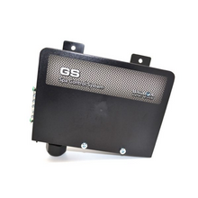
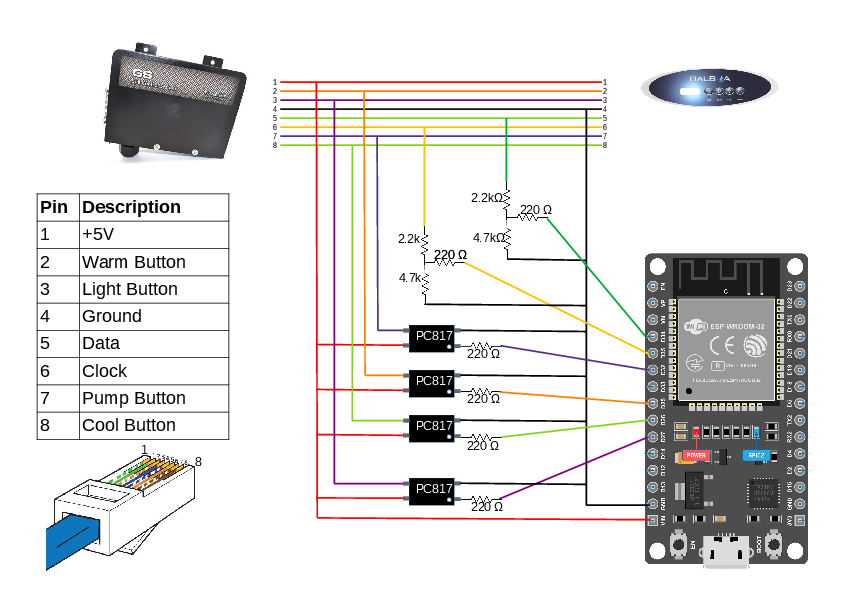
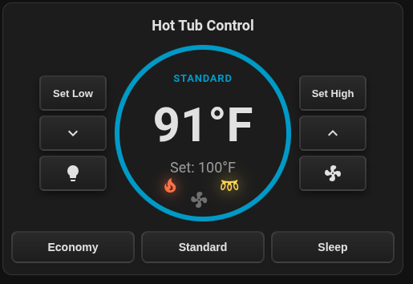
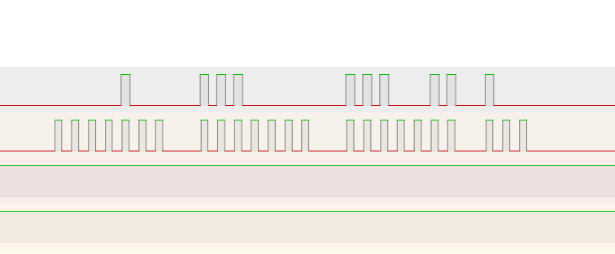
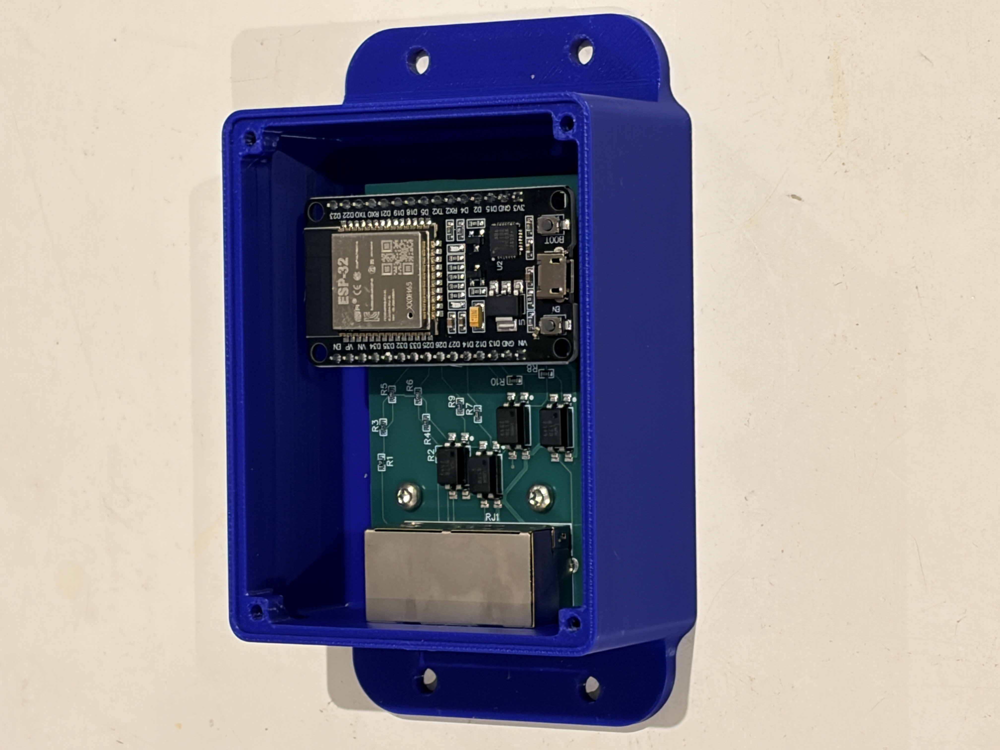
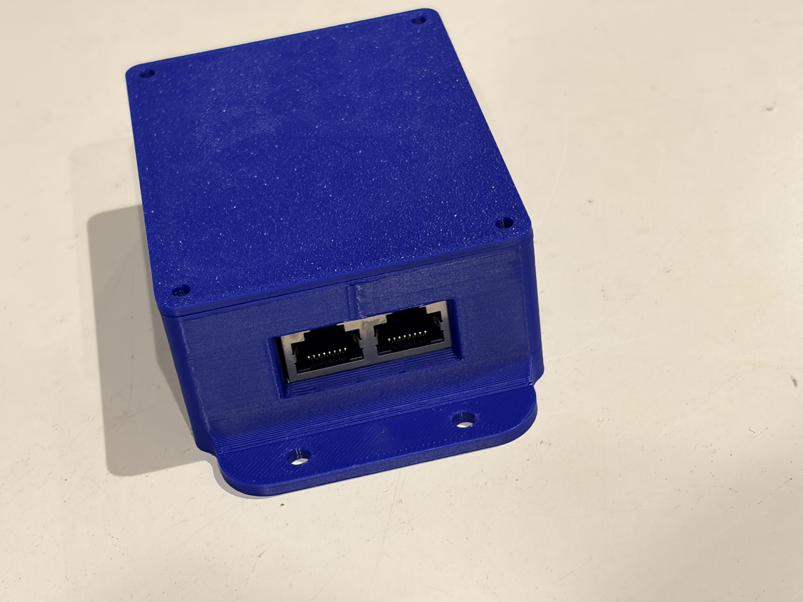
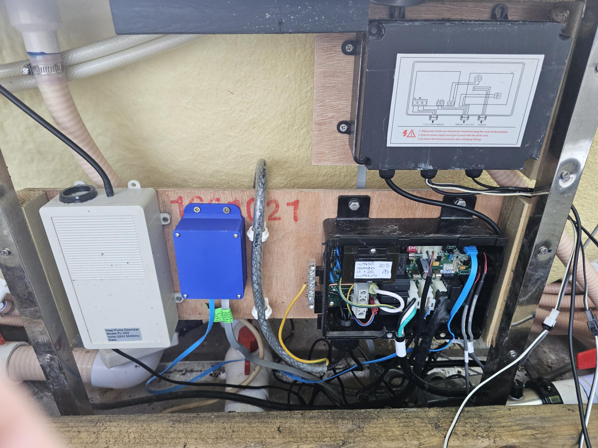

# Balboa-GS100-with-VL260-topside

<p align="center">
  
  
</p>

## Description

This project adds an Wifi module to a Balboa Hot Tub. This project has been tested with a few Balboa control boards and seems to work with any VL200 series or VL400 series topside controllers. I imagine any 3 or 4-button Balboa topside controllers with RJ45 connectors would have a very similar setup. 

---

## Purchase Option

Everything you need to know to build a module is contained in this repository. However, I do have some modules available for purchase as well.

---

## Software Installation

1. Copy the `esp32-spa.yaml` file and the entire `esp32-spa` folder into your Home Assistant config folder under the `esphome/` subfolder. The folder layout should look like:

```
config/
└── esphome/
    ├── esp32-spa.yaml
    └── esp32-spa/
        ├── __init__.py
        ├── binary_sensor.py
        ├── esp32-spa.h
        └── sensor.py
```

2. Edit the UNITS key in the esp32-spa.yaml file to set the temperature units. 

3. In Home Assistant go to **ESPHome**, click **New Device** → **Import From File**, and select `esp32-spa.yaml`.

4. `esp32-spa.yaml` will also look for a `secrets.yaml` file inside the **esphome/** folder for the following keys: `api_key`, `wifi_ssid`, `wifi_password`, `ota_password`, and `ap_password`.

---

## Wiring

- An attempt was made with an ESP8266, but the Wi‑Fi and ISR requirements (or pin/boot choices) caused persistent boot issues, so the project uses an ESP32 which worked reliably.
- The 4 buttons on the topside panel act like switches that connect to 5V when pressed, but when not pressed show ~2.5V. To avoid interfering with the panel we used optocouplers to reproduce the switch signals safely.
- For the data and clock lines we use a simple voltage divider (2.2k and 4.7k) to reduce the voltage down to ~3.4V, then add a 220Ω series resistor to the ESP32 GPIOs.

Wiring Diagram:


ESP32 DEVKIT V1 GPIO assignments:

| Spa RJ45 pin | Function | Wiring diagram color | GPIO pin |
|---:|---|---|---|
| 1 | VIN | red | VIN |
| 2 | Warm Button | orange | 25 |
| 3 | Light Button | purple | 27 |
| 4 | GND | black | GND |
| 5 | Display Data | green | 34 |
| 6 | Clock | yellow | 35 |
| 7 | Jets Button | blue | 32 |
| 8 | Cool Button | lime green | 26 |

---

## Frontend

This repository includes a Home Assistant custom card for controlling and monitoring the spa. To install the frontend component:

1. Copy `spa-control-card.js` into your Home Assistant `www/` folder (e.g., `config/www/spa-control-card.js`).
2. Open the dashboard where you want to add the card, click the three-dot menu (upper-right) and select **Manage resources**.
3. Click **Add resource**, set **URL** to `/local/spa-control-card.js` and **Resourse Type** to `Javascript Module`, then save.
4. Add the card to your dashboard via **Add Card** → search for **Spa Control Card** or use the raw YAML (below)
5. For the Device Name, enter whatever you named your esp device. If you did not modify the yaml file, enter 'esp32-spa'. Given the device name, the frontend can discover all the required entities.

```yaml
type: 'custom:spa-control-card'      # required
device_name: 'esp32-spa'      # required - replace with your esp device name
title: 'Hot Tub Control'     # optional - card title
high_setting: 103         # optional - Temp for one button press to high temp 
low_setting: 80    # optional - Temp for one button press to low temp
show_mode_buttons: true   # optional - show/hide Economy/Standard/Sleep buttons (default: true)

```

If the card doesn't appear immediately, try a hard-refresh (Ctrl/Cmd+Shift+R) or clear the browser cache.



---

## Error Codes

- This integration exposes a `text_sensor` for error codes (sensor.<device name>_spa_error_code). The text sensor shows the 2‑character code from the topside display and a friendly translation when available, for example:

  - `HH - high overheat (water temp over 118 F)`

---

## Heating Mode

This integration exposes a `text_sensor` for the current heating mode (`sensor.<device_name>_spa_mode`). The possible states are **Standard**, **Economy**, and **Sleep**. Standard mode turns the heater and circulation pump on whenever the measured temperature drops below the set temperature. Economy only heats when the circulation pumps are programmed to run. Sleep mode also only heats when the circulation pumps are programmed to run, but also only heats to ~10C/20F below the set temperature. 

The mode is detected by reading the 7-segment display characters `St`, `Ec`, or `SL` that the Balboa controller briefly shows during mode selection. The device automatically reads the current mode on boot (and every 30 minutes) by pressing the Cool button followed by the Light button.


### Example Home Assistant automation (mobile push notification)

Trigger a mobile push when a new error code appears (replace `notify.mobile_app_YOUR_DEVICE_NAME` with your device):

```yaml
alias: "Spa Error Notification"
triggers:
  - platform: state
    entity_id: sensor.esp32_spa_spa_error_code
condition:
  - condition: template
    value_template: >
      
      {{ s not in ['', 'unknown', 'none', 'unavailable'] }}
action:
  - service: notify.mobile_app_YOUR_DEVICE_NAME
    data:
      title: "Spa Alert"
      message: "{{ states('sensor.esp32_spa_spa_error_code') }}"
mode: single
```

## Measurements

- The clock stream consists of 4 packets of data: three packets of 7 bits and a final packet with 3 bits.

- Packet 1 (bits referenced MSB→LSB as 6 5 4 3 2 1 0):
  - Bits 5 and 4 HIGH indicate a `1` in the hundreds digit (Fahrenheit display).
  - Bit 2 is the heater status (when the heater is on this bit pulses).

- Packets 2 & 3: used for the display characters where each bit maps to a segment of the 7-segment display. Here is the bit mapping (MSB→LSB):

```
Bit -> Segment
6   = top
5   = top-right
4   = bottom-right
3   = bottom
2   = bottom-left
1   = top-left
0   = center
```

- Given the above bit mapping, the nubmer 7 would illuminate the top, top-right, and bottom-right segments, so those bits would be HIGH and the packet would look like this: 1110000.

- Packet 4 (3 bits):
  - Bit 2 = pump status
  - Bit 1 = light status

 - The remaining bits always appear LOW in my observation. I use them as a frame checksum. They are: Packet 1 bits 6, 3, 1, 0 and Packet 4 bit 0 (MSB to LSB).


- Timing observations (from logic analyzer):
  - Clock pulses: ~16 µs ON with ~21 µs gap between pulses.
  - Data pulses: ~17.5 µs with ~20 µs gap; data is sampled on the rising edges of the clock.
  - Each frame consists of 24 bits (4 packets of 7 bits, 7 bits, 7 bits, and 3 bits)
  - Between each frame is a LOW segment of ~19ms.

Logic analyzer screenshot:
- In the screenshot below, the top signal is the data signal and the bottom is the clock.
  - Packet 1 (bits 6543210)
    - bit 6, 1, 0 LOW: used as a checksum (always LOW)
    - bit 5, 4 LOW: indicates the hundreds digit of the display will be blank
    - bit 2 HIGH: indicates the heater is on
  - Packet 2 (bits 6543210)
    - bit 6, 5, 4 HIGH: Translates into the number 7
  - Packet 3 (bits 6543210)
    - bit 6, 5, 4, 1, 0 HIGH: Translates into the number 9
  - Therefore the display will show the temp of 79 degrees
  - Packet 4 (bits 210)
    - bit 2 HIGH: indicates the jets (in this case the circulation pump) is on
    - bit 1 LOW: indicates the lights are off
    - bit 0 LOW: used as a checksum (always LOW)



---


## Images








---


## Other Balboa projects

- Balboa-GS510SZ with panel VL700S: https://github.com/MagnusPer/Balboa-GS510SZ
- GL2000 Series: https://github.com/netmindz/balboa_GL_ML_spa_control
- BP Series: https://github.com/ccutrer/balboa_worldwide_app
- GS523SZ: https://github.com/Shuraxxx/-Balboa-GS523SZ-with-panel-VL801D-DeluxeSerie--MQTT


